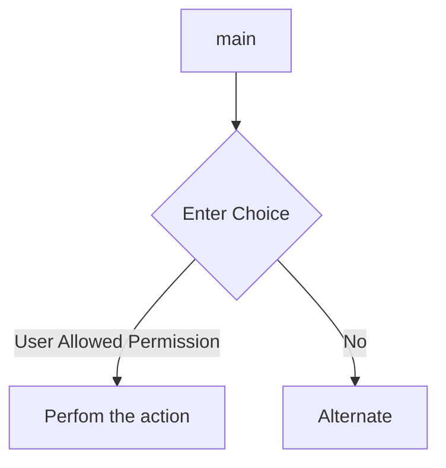

# Problem Statement
###### Storing a schoold student data each student have 5 subjects need to selct from 7 subjects 
###### each class have 3 students total 5 class
store basic details o student and class and taken subjects 
now a grading system of all sudent per subject 

A(70+) B(60+) C(50+) D(Less that 50) F less than 33

Design this

User can add student into class, each student will need to selct 5 subject
User can delte a student 
user can modify student class and subjects
user check each student grade
user assign each student grade on each subject
'''


1. Functional Requirement
2. Non functional Requirement
3. Capacity Estimation
4. API Design
5. DB design
6. LLD
8. HLD

#### FUNCTIONAL REQUIREMENT

1. Maintain a list of users who can modify the data, prevideldges.
2. Each class will have atleast 3 student, if less that that student have to be merged to different class.
3. User can add a student.
4. User can delete a student. 
5. Deleted student's info will be fully removed.
6. No history of student is maintained.
7. User will select subjects for student.
8. User can modify the subject for student.
9. User can add marks 

##### Student  
   1. Basic details like name, address, parents name , parents contact detail, DOB, grade/ Subject list will be maintained.
   2 . method for age calucation using DOB.
   3. Getter to fetch the details of student based on id ,or combination of name, panrets name etc.
   4. Student status Promoted/ enrolled/ Failed maintained.
   5. When student is merged to different class then information should be maintained - subject marks etc.
   6. When student is failed they remain in same class and their marks can be reset by the user and their status remains Repeated.
   7. 
##### User 
   1. maintain list of user based on some previledges who can access what info of student.

##### Grade:
   1. auto calculation of grade base on the mark stored.
   2. getter to fetch the grades.


#### Non-funcitonal requirement

##### 1. Security 
    a. no student should be able to see each others result.
    b. 
##### 2. Reliability
    a. modification should be atomic. 
    b. 

#### Capacity Estimation
```
Student
{
    std::string mName;  32B
    std::string mParentDetail; 32B;
    std::string address;    32B
    std::string contactDetail; 32B
    struct DOB{
        uint8_t date;
        unit8_t month;
        unit16_t year;
    }; 4B
     
   
    

}; = 220B
```

Case 1:
 5 class each class 5 student= 5*5*220= 3300B
Case 2:
 40 class each class 40 student= 40*40*220 = 176000B ~176KB
Case 3:
200 school = 200*176KB ~= 35MB
Case 4: 
University 2,00,000 schools = 35GB

#### API DESIGN
```
class SchoolManagement{
  data_type StudentList;
  data_type UsersList;
  data_type SubjectPoolList;
  
  void registerUser();
  void addSubject();
  void addStudent();
  void removeStudent();
  void removeSubject();
  void addSubject();
}
Enum class Users{
  Teacher, Admin, Viewer, Management
}

Enum class Choice
{
  Mod
}

Enum class Status
{
  Promoted, Enrolled, Not-Promoted
}

Enum class Level
{
  Basic, Intermediate, Advanced
}
 
class Subject{
    std::string subjectName;


}

class Student {
private:
    std::string mName;
    std::string mParentName;
    std::string mAddress;
    std::string contactDetails;
    struct DOB
    {
        char date;
        char month;
        char year;

    }
    std::vector<subject*> subjectList;
    std::vector<std::pair<int subjectId, int marks>> marksList;
    std::vector<std::pair<int subjectId, char grade>> gradeList;
    Enum status {
        Passed, 
        Enrolled,
        Failed
    }

    public:
        newStudent(){//set all the basic detials};
        setName(std::string &);
        setParentName(std::string &);
        setAddress(std::string &);
        setConatactDetails(std::string & );
        modifyStudentDetails(){//set the basic details};
        addSubjectMarks(int subjectId, int marks);
        selectSubjects(){ //for each studend can have exactly 5 core subjects, max 2 vocational subject}

};

ClassName
{
    std::string classId;
    std::vector<Student> studentList;
    const Student getStudentDetail(int studentID); // marks cant be seen by other student.
};

Subject 
{
    int subjectId;
    enum Level{ Basic, Intermediate, Advanced}
    std::string subjectName;
}

User
{
    // maintain user with differnt permission level
    };


```


#### Flow Diagram



